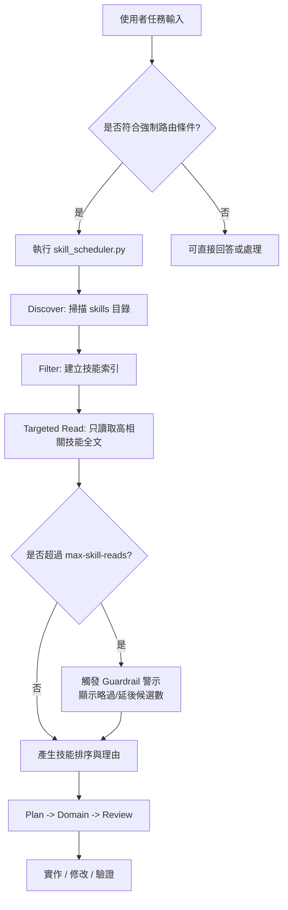

# my-agent-bootstrap

`my-agent-bootstrap` 是一個可重用的 Codex 專案接線層（Bootstrap Kit），目標是在新專案中快速啟用：

- `AGENTS.md` 規範（含條件式強制路由閘門）
- 兩段式技能檢索（Discover/Filter -> Targeted Read）
- Context Guardrail（`max-skill-reads`，預設 3）
- 路由診斷與警示輸出（超限時顯示略過候選）

## 架構流程（Mermaid）



## 目錄結構

```text
my-agent-bootstrap/
├─ AGENTS.md
├─ skill_scheduler.py
├─ services/
│  └─ skill_scheduler.py
├─ tests/
│  └─ test_skill_scheduler.py
└─ tools/
   └─ bootstrap_agent.sh
```

## 快速開始

### 1) 在 bootstrap repo 內執行（來源模板）

```bash
cd /path/to/my-agent-bootstrap
chmod +x tools/bootstrap_agent.sh
```

### 2) 套用到目標專案

```bash
tools/bootstrap_agent.sh --target /path/to/your-project --force
```

### 3) 健康檢查

```bash
cd /path/to/your-project
python skill_scheduler.py --task "health check" --max-skill-reads 3 --format text
```

## 強制路由條件（摘要）

符合以下任一條件時，必須先執行：

```bash
python skill_scheduler.py --task "<task>" --max-skill-reads 3
```

- 需要產生/修改程式碼
- 涉及 CI/CD、Docker、部署、依賴管理
- 多步驟或跨模組任務（如規劃、重構）

例外：純理論問答、語法解釋、單行除錯可略過。

## 常用參數

- `--top`: 回傳前 N 個技能建議
- `--max-skill-reads`: 全文讀取上限（Context Guardrail）
- `--format text|json`: 輸出格式

## 注意事項

- 本 repo 只負責「接線層」，技能內容建議維持在 `my-agent-skills`。
- 若目標專案缺少 `my-agent-skills`，health check 會提示 missing directories，屬正常訊號。
