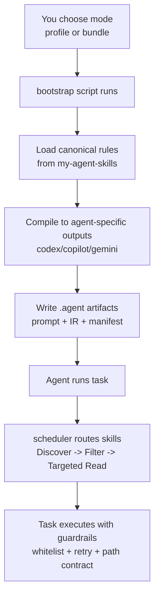
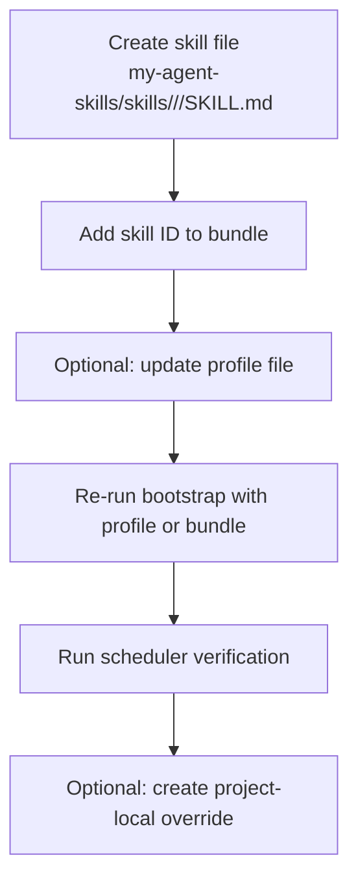

# my-agent-bootstrap

Use this tool when you want one `my-agent-skills` repository to drive different AI agents (Codex, Copilot CLI, Gemini CLI) in a consistent, repeatable way.

## Start Here (New User)

If you are seeing this project for the first time, use this order:

1. Bootstrap your project once.
2. Choose `--profile` mode (recommended) or `--bundle` mode (quick test).
3. Run scheduler once to verify skills are loaded.
4. Start using your AI agent with generated `.agent` artifacts.

## What Problem This Solves

Without this tool, each AI CLI needs different prompt/config formats.  
With this tool:

1. `my-agent-skills` is your single source of truth.
2. `agent-bootstrap` translates that into agent-specific outputs.
3. You avoid manually maintaining 3 different prompt files.

## Two Repos, Two Responsibilities

1. `my-agent-skills` stores content:
- `skills/<domain>/<skill>/SKILL.md` (`domain` = `shared` / `engineer` / `finance` / `meta`)
- `bundles/<bundle>.yaml`
- `policies/base.yaml`
- `profiles/*.yaml`

2. `agent-bootstrap` stores integration logic:
- bootstrap scripts
- scheduler (`skill_scheduler.py`)
- bundle/profile compiler
- adapter templates (`codex`, `copilot`, `gemini`)

These repos are versioned independently.

## Quick Setup

Windows:

```bat
tools\bootstrap_agent.bat --target C:\path\to\your-project --force
```

Linux/macOS:

```bash
chmod +x tools/bootstrap_agent.sh
tools/bootstrap_agent.sh --target /path/to/your-project --force
```

## Ready-to-Copy Examples

You can copy these files directly:

1. `agent-bootstrap/examples/agent.profile.engineer-codex.yaml`
2. `agent-bootstrap/examples/agent.profile.finance-all.yaml`
3. `agent-bootstrap/examples/bundle.template.yaml` (place it under `my-agent-skills/bundles/<name>.yaml`)

What this does:

1. Mounts or clones `my-agent-skills` into your target project.
2. Copies scheduler/routing files.
3. Runs health check.
4. Optionally runs GitNexus.

## Mode Selection: `--profile` vs `--bundle`

### Use `--profile` when you want repeatable team behavior

`--profile` means: "Apply a saved configuration file."

Example profile (`agent.profile.yaml`):

```yaml
name: engineer-codex
bundle: engineer
agent: codex
skills_repo: my-agent-skills
adapter_output: .agent
max_skill_reads: 3
generate_launchers: true
```

Run:

```bash
tools/bootstrap_agent.sh --target /path/to/project --profile agent.profile.yaml
```

Why use this:

1. Same result every time.
2. Easy to audit in git.
3. Best for team/onboarding.

### Use `--bundle` when you want quick compile without creating profile file

`--bundle` means: "Choose one role package from `my-agent-skills/bundles/*.yaml`."

Example:

```bash
tools/bootstrap_agent.sh --target /path/to/project --bundle engineer --agent codex
```

What `--bundle engineer` does:

1. Loads `my-agent-skills/bundles/engineer.yaml`.
2. Reads listed skill IDs.
3. Compiles agent-specific prompt artifacts for the selected `--agent`.

## What Each Key Parameter Means (User Perspective)

| Parameter | Why You Provide It | What Happens |
|---|---|---|
| `--target` | Tell tool where your project is | Files are installed into that project |
| `--profile` | Reuse a saved setup | Bundle/agent/output come from profile |
| `--bundle` | Pick a role package quickly | Compiler uses that bundle YAML |
| `--agent` | Select target AI CLI | Generates codex/copilot/gemini outputs |
| `--adapter-output` | Choose where generated files go | `.agent` artifacts are written there |
| `--max-skill-reads` | Control routing context budget | Scheduler read guardrail is enforced |

Notes:

1. `--profile` and `--bundle` cannot be used together in the same run.
2. `--agent all` generates outputs for all supported CLIs.

## End-to-End Flow (What Each Step Is Doing)



## Generated Files You Will See

```text
<project>/.agent/
  codex/<bundle>/AGENTS.generated.md
  copilot/<bundle>/copilot.prompt.md
  gemini/<bundle>/gemini.prompt.md
  <adapter>/<bundle>/ir.json
  <adapter>/<bundle>/manifest.json
  launchers/launch_<adapter>.bat
  launchers/launch_<adapter>.sh
  profile.manifest.json
```

## Verify It Works

Status check:

```bash
python skill_scheduler.py --status --format text
```

Task check:

```bash
python skill_scheduler.py --task "plan refactor" --context "planning-implementation" --format json
```

Whitelist check:

```bash
python skill_scheduler.py \
  --task "plan refactor" \
  --context "planning-implementation" \
  --intent-whitelist "planning-implementation,handling-review" \
  --format json
```

## How To Add A New Skill (Practical Workflow)



Step-by-step:

1. Create `my-agent-skills/skills/<domain>/<new-skill>/SKILL.md`.
2. Set stable frontmatter `name` (skill ID).
3. Add skill ID into one or more `bundles/*.yaml`.
4. If needed, update `profiles/*.yaml`.
5. Re-apply in target project via `--profile` or `--bundle`.
6. Verify with scheduler commands.

If you need project-specific behavior:

1. Create local override in target project: `skills/<skill>/SKILL.md`.
2. Keep the same frontmatter `name` as global skill.
3. Put only project-specific differences.

## Troubleshooting

1. `Bundle not found`  
Check `my-agent-skills/bundles/<bundle>.yaml`.

2. `missing skill`  
Bundle references a skill ID that is not present in any `SKILL.md` frontmatter `name`.

3. `invalid_intent`  
`--context` missing or not in `--intent-whitelist`.

4. `0 skill(s)`  
`my-agent-skills` not mounted in target project. Re-run bootstrap without `--skip-submodule`.

5. `profile apply failed`  
Check profile path, YAML format, and `skills_repo` path.

## Traditional Chinese Guide

See:

- `USAGE_ZH_TW.md`
