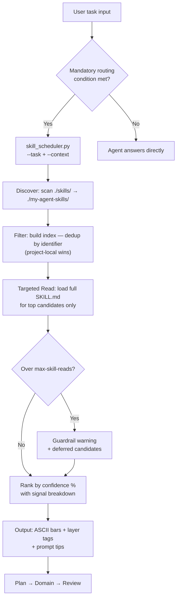

# my-agent-bootstrap

> Plug-and-play routing layer that turns any AI coding agent (Codex, Copilot CLI, Claude Code) into a skill-aware assistant — in one command.

## What This Does

`my-agent-bootstrap` is a **zero-config bootstrap kit** that wires up:

| Capability | Description |
|---|---|
| **AGENTS.md Routing Policy** | Conditional routing gate — the agent must consult the skill scheduler before complex tasks |
| **Dual-Layer Skill Architecture** | `./skills/` (project-local) overrides `./my-agent-skills/` (global), first-seen-wins dedup |
| **Skill Scheduler** | Two-phase retrieval (Discover/Filter → Targeted Read) with context guardrail |
| **Semantic Bridging** | `--context` parameter lets the agent pass its understanding of fuzzy user intent |
| **Confidence Visualization** | ASCII progress bars, layer labels, signal breakdown, and prompt improvement tips |
| **Environment Diagnostics** | `--status` mode checks git, GitNexus, git exclude, overrides, and fallback skills |
| **GitNexus Knowledge Graph** | Auto-indexes your codebase into a knowledge graph for deeper code understanding |
| **Team Repo Isolation** | Agent tooling auto-excluded from git tracking via `.git/info/exclude` |

## Quick Start

### Prerequisites

- Python 3.10+
- Git
- (Optional) Node.js — required for GitNexus knowledge graph

### Step 1 — Clone this repo

```bash
git clone https://github.com/Alanlee0323/my-agent-bootstrap.git
```

### Step 2 — Run bootstrap on your project

**Linux / macOS:**
```bash
cd my-agent-bootstrap
chmod +x tools/bootstrap_agent.sh
tools/bootstrap_agent.sh --target /path/to/your-project --force
```

**Windows:**
```bat
cd my-agent-bootstrap
tools\bootstrap_agent.bat --target C:\path\to\your-project --force
```

That's it. The bootstrap script automatically:

1. **Mounts `my-agent-skills`** as a git submodule (or `git clone` for non-git targets)
2. **Copies routing files** — `AGENTS.md`, scheduler engine, and tests
3. **Runs GitNexus analyze** — builds a codebase knowledge graph (git repos only)
4. **Runs a health check** — verifies skill loading and routing
5. **Writes `.git/info/exclude`** — prevents agent tooling from polluting your shared repo

### Step 3 — Verify

```bash
cd /path/to/your-project
python skill_scheduler.py --status
```

Expected output:
```
Environment diagnostics
- git repo: ✓ yes
- GitNexus index (.gitnexus/): ✓ present
- git exclude marker: ✓ present

Skill layers
- /path/to/your-project/skills: 0 skill(s)
- /path/to/your-project/my-agent-skills: 13 skill(s)

Fallback skills
- planning-implementation: ✓ found
- planning: ✓ found
- managing-environment: ✓ found
```

### Step 4 — (Optional) Add project-local skill overrides

```bash
mkdir -p skills/cicd-skills
cat > skills/cicd-skills/SKILL.md << 'EOF'
---
name: managing-cicd-workflow
description: Project-specific CI/CD for my-app
---
# Inherits from ./my-agent-skills/cicd-skills/SKILL.md

## When to use this skill
- deploy_my_app_staging
- run smoke tests on port 8080
EOF
```

## How It Works



## Directory Layout

After bootstrap, your project looks like this:

```
your-project/
├─ skills/                        ← Project-local overrides (you create, optional)
│  └─ cicd-skills/
│     └─ SKILL.md                 ← Overrides the global cicd-skills
├─ my-agent-skills/               ← Global skill library (auto-mounted by bootstrap)
│  ├─ cicd-skills/
│  ├─ planning/
│  ├─ ...
│  └─ global-rules.md
├─ .gitnexus/                     ← Knowledge graph index (auto-excluded from git)
├─ AGENTS.md                      ← Routing policy + GitNexus context (appended)
├─ CLAUDE.md                      ← Claude Code context (generated by GitNexus)
├─ skill_scheduler.py             ← CLI entry point
├─ services/
│  └─ skill_scheduler.py          ← Core routing engine
└─ tests/
   └─ test_skill_scheduler.py     ← 10 tests covering all features
```

## Dual-Layer Skill Architecture

| Layer | Directory | Purpose | Examples |
|---|---|---|---|
| **Project-Local** | `./skills/` | Project-specific overrides & unique skills | IP allowlists, job names, hardware mappings |
| **Global** | `./my-agent-skills/` | Cross-project workflows & guardrails | Trunk-based CI/CD, planning, code review |

### Override Rules

1. Scheduler scans `./skills/` first, then `./my-agent-skills/`.
2. **Same-identifier dedup**: first loaded wins → project-local always overrides global.
3. When `./skills/` is absent, the global layer is used in full.
4. Overrides are **tracked** — the load report shows which global skills were replaced.

### Writing a Project Override

- Set `name` in frontmatter to match the global skill's identifier exactly.
- Write only the differences (IPs, env names, job IDs). Reference the global skill for shared logic.
- Add a note at the top: `# Inherits from ./my-agent-skills/<skill>/SKILL.md`

## Scheduler CLI Reference

### Routing a task

```bash
python skill_scheduler.py --task "deploy to production" --context "user wants CI/CD pipeline for staging" --max-skill-reads 3
```

Sample output:
```
Skill preload summary
- total skills: 13
- route hints: 13
- max detailed reads: 3
- ./skills: 1 skill file(s)
- ./my-agent-skills: 13 skill file(s)
- overrides:
  - managing-cicd-workflow (global skipped)
- detailed reads used: 3/3

Scheduled skills
1. managing-cicd-workflow [project-local]  ████████████░░░░░░░░ 62%
   signals: ✓ alias | ✓ keyword | ✓ global-rule | ✓ trigger
2. handling-review [global]  ████░░░░░░░░░░░░░░░░ 19%
   signals: ✓ global-rule
```

### Environment diagnostics

```bash
python skill_scheduler.py --status
```

Checks: git repo presence, `.gitnexus/` index, `.git/info/exclude` marker, skill layer scan results, override list, and fallback skill validation.

### Full parameter reference

| Parameter | Description | Default |
|---|---|---|
| `--task` | Task description to route | `""` (summary only) |
| `--context` | Agent's semantic understanding of user intent (improves fuzzy matching) | `""` |
| `--top` | Max skill suggestions to return | `5` |
| `--max-skill-reads` | Full-content read limit per schedule (Context Guardrail) | `3` |
| `--format` | Output format: `text` or `json` | `text` |
| `--status` | Show environment diagnostics instead of routing | `false` |

### AGENTS.md Routing Hook

When the agent encounters a complex task (code generation, CI/CD, multi-step planning), `AGENTS.md` mandates:

```bash
python skill_scheduler.py --task "<task description>" --context "<agent's understanding>" --max-skill-reads 3
```

The agent uses the output (confidence %, layer, signals) to decide which skills to load and in what order.

## GitNexus Integration

[GitNexus](https://github.com/abhigyanpatwari/GitNexus) indexes your codebase into a knowledge graph — dependencies, call chains, clusters, and execution flows — then exposes it through the agent context.

### How it works

1. Bootstrap copies `AGENTS.md` first (Commander Policy)
2. `npx gitnexus analyze` **appends** knowledge graph context to `AGENTS.md` inside `<!-- gitnexus:start/end -->` markers
3. Re-running bootstrap only updates the marked section — your routing policy is never overwritten

### Requirements

- Target must be a git repo (auto-skipped otherwise)
- Node.js must be installed (`npx` available)
- First run downloads the GitNexus npm package automatically

### Skip GitNexus

```bash
tools/bootstrap_agent.sh --target /path/to/project --skip-gitnexus
```

## Team Repo Isolation

Bootstrap writes agent tool paths to `.git/info/exclude` — a local-only gitignore that is **never committed**:

```
# Bootstrap agent tools
AGENTS.md
CLAUDE.md
skill_scheduler.py
services/skill_scheduler.py
tests/test_skill_scheduler.py
my-agent-skills/
skills/
.gitnexus/
```

- **Idempotent**: re-running bootstrap does not duplicate entries
- **Git repos only**: non-git targets skip this step automatically
- **No `.gitignore` pollution**: uses `.git/info/exclude` so teammates are unaffected

## Bootstrap Script Options

| Flag | Description |
|---|---|
| `--target <dir>` | Target project directory (default: current directory) |
| `--source-root <dir>` | Source template root (default: parent of bootstrap script) |
| `--skills-url <url>` | Git URL for `my-agent-skills` repo |
| `--skills-path <path>` | Submodule path in target (default: `my-agent-skills`) |
| `--max-skill-reads <n>` | Guardrail value for health check (default: `3`) |
| `--force` | Overwrite existing target files |
| `--skip-submodule` | Skip submodule/clone of `my-agent-skills` |
| `--skip-gitnexus` | Skip GitNexus analyze step |
| `--skip-healthcheck` | Skip post-bootstrap health check |
| `--dry-run` | Print actions without applying changes |

## Troubleshooting

| Symptom | Cause | Fix |
|---|---|---|
| `0 skill file(s)` after bootstrap | `my-agent-skills` not cloned | Check git access, re-run without `--skip-submodule` |
| GitNexus step skipped | Not a git repo, or Node.js not installed | Run `git init` first, or install Node.js |
| Fallback skill `⚠ missing` in `--status` | Skill renamed or not present in global layer | Verify `my-agent-skills/` contains the expected skill directories |
| `context guardrail triggered` warning | More candidates than `max-skill-reads` allows | Increase `--max-skill-reads` or make your `--task` description more specific |
| Override not taking effect | `name` in frontmatter doesn't match global identifier | Ensure `name:` in project-local SKILL.md matches exactly |

## FAQ

**Q: Do I need to clone `my-agent-skills` separately?**
No. Bootstrap handles it automatically via git submodule (or `git clone` for non-git targets).

**Q: Will this pollute my team's shared repo?**
No. All agent files are excluded via `.git/info/exclude` (local-only, never committed).

**Q: Can I use this without GitNexus?**
Yes. Pass `--skip-gitnexus` or simply don't have Node.js installed — the step is auto-skipped.

**Q: What if `./skills/` doesn't exist?**
That's fine. The global layer works standalone. Create `./skills/` only when you need project-specific overrides.

**Q: Which AI agents does this support?**
Any agent that reads `AGENTS.md` — including OpenAI Codex, GitHub Copilot CLI, and Claude Code.
