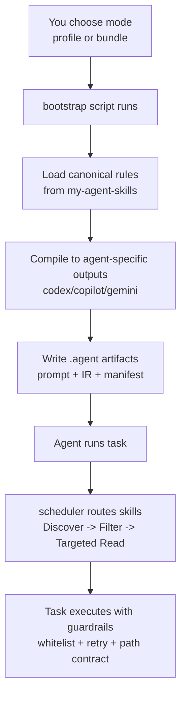
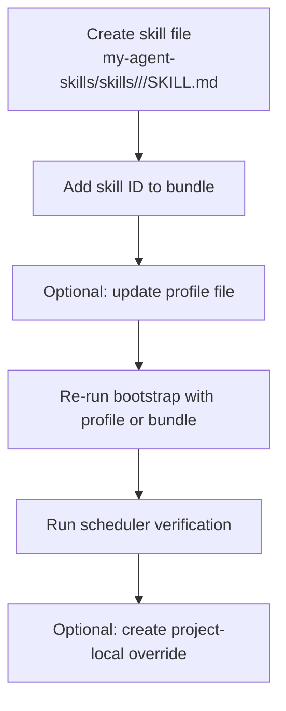

# my-agent-bootstrap

Use this tool when you want one `my-agent-skills` repository to drive different AI agents (Codex, Copilot CLI, Gemini CLI) in a consistent, repeatable way.

## Start Here (New User)

If you are seeing this project for the first time, use this order:

1. Bootstrap your project once.
2. Choose `--profile` mode (recommended) or `--bundle` mode (quick test).
3. For existing projects, re-run with `--upgrade` when tool/spec versions change.
4. Run scheduler once to verify skills are loaded.
5. Start using your AI agent with generated `.agent` artifacts.

## What Problem This Solves

Without this tool, each AI CLI needs different prompt/config formats.  
With this tool:

1. `my-agent-skills` is your single source of truth.
2. `agent-bootstrap` translates that into agent-specific outputs.
3. You avoid manually maintaining 3 different prompt files.

## Two Repos, Two Responsibilities

1. `my-agent-skills` stores content:
- `skills/<domain>/<skill>/SKILL.md` (`domain` = `shared` / `engineer` / `finance` / `meta`)
- `bundles/<bundle>.yaml`
- `policies/base.yaml`
- `profiles/*.yaml`

2. `agent-bootstrap` stores integration logic:
- bootstrap scripts
- scheduler (`skill_scheduler.py`)
- bundle/profile compiler
- adapter templates (`codex`, `copilot`, `gemini`)

These repos are versioned independently.

## Quick Setup

Windows:

```bat
tools\bootstrap_agent.bat --target C:\path\to\your-project --force
```

Linux/macOS:

```bash
chmod +x tools/bootstrap_agent.sh
tools/bootstrap_agent.sh --target /path/to/your-project --force
```

Upgrade existing bootstrap:

```bash
tools/bootstrap_agent.sh --target /path/to/your-project --upgrade --update-skills-remote
```

## Ready-to-Copy Examples

You can copy these files directly:

1. `agent-bootstrap/examples/agent.profile.engineer-codex.yaml`
2. `agent-bootstrap/examples/agent.profile.finance-all.yaml`
3. `agent-bootstrap/examples/bundle.template.yaml` (place it under `my-agent-skills/bundles/<name>.yaml`)

What this does:

1. Mounts or clones `my-agent-skills` into your target project.
2. Copies scheduler/routing files.
3. Runs health check.
4. Optionally runs GitNexus.

## Mode Selection: `--profile` vs `--bundle`

### Use `--profile` when you want repeatable team behavior

`--profile` means: "Apply a saved configuration file."

Example profile (`agent.profile.yaml`):

```yaml
name: engineer-codex
bundle: engineer
agent: codex
skills_repo: my-agent-skills
adapter_output: .agent
max_skill_reads: 3
generate_launchers: true
```

Run:

```bash
tools/bootstrap_agent.sh --target /path/to/project --profile agent.profile.yaml
```

Why use this:

1. Same result every time.
2. Easy to audit in git.
3. Best for team/onboarding.

### Use `--bundle` when you want quick compile without creating profile file

`--bundle` means: "Choose one role package from `my-agent-skills/bundles/*.yaml`."

Example:

```bash
tools/bootstrap_agent.sh --target /path/to/project --bundle engineer --agent codex
```

What `--bundle engineer` does:

1. Loads `my-agent-skills/bundles/engineer.yaml`.
2. Reads listed skill IDs.
3. Compiles agent-specific prompt artifacts for the selected `--agent`.

## What Each Key Parameter Means (User Perspective)

| Parameter | Why You Provide It | What Happens |
|---|---|---|
| `--target` | Tell tool where your project is | Files are installed into that project |
| `--profile` | Reuse a saved setup | Bundle/agent/output come from profile |
| `--bundle` | Pick a role package quickly | Compiler uses that bundle YAML |
| `--agent` | Select target AI CLI | Generates codex/copilot/gemini outputs |
| `--adapter-output` | Choose where generated files go | `.agent` artifacts are written there |
| `--max-skill-reads` | Control routing context budget | Scheduler read guardrail is enforced |
| `--upgrade` | Re-apply existing setup safely | Restores prior mode from state and forces managed-file refresh |
| `--update-skills-remote` | Pull latest `my-agent-skills` commit | Runs remote submodule/clone update before compile |
| `--clean-stale` | Remove no-longer-used generated artifacts | Deletes stale files tracked in previous bootstrap state |

Notes:

1. `--profile` and `--bundle` cannot be used together in the same run.
2. `--agent all` generates outputs for all supported CLIs.
3. `--upgrade` auto-enables overwrite (`--force`) and stale cleanup behavior.
4. State is persisted at `<adapter-output>/bootstrap.state.json` for repeatable upgrades.

## Upgrade Existing Projects (No Manual Delete)

Use this when project was already bootstrapped and you upgraded `agent-bootstrap` or `my-agent-skills`.

Profile-based project:

```bash
tools/bootstrap_agent.sh --target /path/to/project --upgrade
```

Bundle-based project (explicit):

```bash
tools/bootstrap_agent.sh --target /path/to/project --upgrade --bundle engineer --agent codex
```

Bundle/profile details are read from `bootstrap.state.json` when omitted.

## End-to-End Flow (What Each Step Is Doing)


```mermaid
flowchart TD
    A[You choose mode<br/>profile or bundle] --> B[bootstrap script runs]
    B --> C[Load canonical rules<br/>from my-agent-skills]
    C --> D[Compile to agent-specific outputs<br/>codex/copilot/gemini]
    D --> E[Write .agent artifacts<br/>prompt + IR + manifest]
    E --> F[Agent runs task]
    F --> G[scheduler routes skills<br/>Discover -> Filter -> Targeted Read]
    G --> H[Task executes with guardrails<br/>whitelist + retry + path contract]
```

## Generated Files You Will See

```text
<project>/.agent/
  codex/<bundle>/AGENTS.generated.md
  copilot/<bundle>/copilot.prompt.md
  gemini/<bundle>/gemini.prompt.md
  <adapter>/<bundle>/ir.json
  <adapter>/<bundle>/manifest.json
  bundle.manifest.json
  launchers/launch_<adapter>.bat
  launchers/launch_<adapter>.sh
  profile.manifest.json
  bootstrap.state.json
```

## Recommended Team Setup For Codex + Copilot CLI + Gemini CLI

If you know you will use all 3 agents in the same project, use one shared profile and generate all prompts together.

Example `agent.profile.yaml`:

```yaml
name: engineer-tri-cli
bundle: engineer
agents:
  - codex
  - copilot
  - gemini
skills_repo: my-agent-skills
adapter_output: .agent
max_skill_reads: 3
generate_launchers: true
```

What this gives you:

1. One shared bundle/skill contract across all 3 CLIs.
2. One bootstrap command to regenerate Codex/Copilot/Gemini outputs together.
3. Portable launchers that resolve project root and scheduler at runtime instead of hardcoding machine-specific absolute paths.

## Version Control Boundary

Commit these as source of truth:

1. `agent.profile.yaml` or your chosen bundle/profile config.
2. `my-agent-skills/` as a git submodule or vendored directory.
3. `skills/` for project-local overrides only.

Recommended to regenerate locally instead of committing:

1. `.agent/` artifacts, launchers, and manifests.
2. `bootstrap.state.json`.
3. `.gitnexus/`.
4. `.git/info/exclude`.

Choose one bootstrap-runtime policy and keep it consistent:

1. Per-machine bootstrap (recommended): do not commit `AGENTS.md`, `GEMINI.md`, `skill_scheduler.py`, `services/skill_scheduler.py`, `tests/test_skill_scheduler.py`; regenerate them on each machine.
2. Repo-managed bootstrap: commit those files if you want zero-init clones, but then treat bootstrap refreshes like normal source changes and review diffs in git.

## Recommended `.gitignore` For Target Projects

If you follow the recommended per-machine bootstrap workflow, add this to the target project's `.gitignore`:

```gitignore
# Agent bootstrap generated outputs
.agent/
.gitnexus/

# Local bootstrap state
bootstrap.state.json

# Per-machine bootstrap runtime files
AGENTS.md
GEMINI.md
CLAUDE.md
skill_scheduler.py
services/skill_scheduler.py
tests/test_skill_scheduler.py
```

Notes:

1. Do not ignore `my-agent-skills/` if you use it as a committed submodule.
2. Do not ignore `skills/` if you store project-local overrides there.
3. If you choose repo-managed bootstrap instead, remove the runtime-file entries from `.gitignore` and commit those files intentionally.

## SOP

### 1. First-Time Setup On A New Machine

1. Clone the target project.
2. If `my-agent-skills/` is a submodule, run:

```bash
git submodule update --init --recursive
```

3. Bootstrap with your shared profile:

```bash
tools/bootstrap_agent.sh --target /path/to/project --profile agent.profile.yaml --force
```

4. Verify scheduler wiring:

```bash
python skill_scheduler.py --status --format text
python skill_scheduler.py --task "health check" --top 1 --format text
```

### 2. Daily Regeneration After Project / Skill Changes

Use this after changing project-local overrides, bundle specs, profile settings, or updating `agent-bootstrap`:

```bash
tools/bootstrap_agent.sh --target /path/to/project --upgrade
```

This restores the previous mode from `bootstrap.state.json`, refreshes managed files, and cleans stale `.agent` outputs.

### 3. Update Shared `my-agent-skills` Before Regeneration

Use this when the remote skills package moved forward and you want the latest shared rules first:

```bash
tools/bootstrap_agent.sh --target /path/to/project --upgrade --update-skills-remote
```

If you commit the submodule pointer, review and commit that pointer change like any other dependency update.

### 4. Create A Project-Local Skill

Use this when a single project needs a skill that should not be added to shared `my-agent-skills`.

```bash
python tools/bootstrap_add_local_skill.py \
  --project-root /path/to/project \
  --skill "Local Station Debug" \
  --description "project-only station debugging workflow" \
  --domain engineer \
  --bundle engineer
```

This will:

1. Create `skills/engineer/local-station-debug/SKILL.md`
2. Use the canonical template from `templates/skill/SKILL.md.tmpl`
3. Add that skill id into `bundles.local/engineer.yaml`
4. Leave source-of-truth updated, but generated `.agent` artifacts still need refresh

Optional project-level defaults live in `.agent-bootstrap.yaml`:

```yaml
local_skill_template: custom-skill-template.md.tmpl
default_domain: engineer
default_bundle: engineer
```

After adding or editing any project-local skill, regenerate artifacts:

```bash
tools/bootstrap_agent.sh --target /path/to/project --upgrade
```

If you forget to refresh, `skill_scheduler.py` will report that generated agent artifacts are stale and suggest the recovery command.

### 5. How To Use Codex / Copilot CLI / Gemini CLI Together

Generated prompt locations:

1. Codex: `.agent/codex/<bundle>/AGENTS.generated.md`
2. Copilot CLI: `.agent/copilot/<bundle>/copilot.prompt.md`
3. Gemini CLI: `.agent/gemini/<bundle>/gemini.prompt.md`

Generated launchers:

1. `.agent/launchers/launch_codex.sh` / `.bat`
2. `.agent/launchers/launch_copilot.sh` / `.bat`
3. `.agent/launchers/launch_gemini.sh` / `.bat`

Recommended collaboration pattern:

1. Use Codex for implementation/refactor tasks.
2. Use Copilot CLI for quick edit/test loops and secondary implementation passes.
3. Use Gemini CLI for broad exploration, synthesis, and review.
4. Keep all 3 on the same profile so scheduler routing, intent whitelist, and retry rules stay consistent.

Launcher usage pattern:

```bash
./.agent/launchers/launch_codex.sh <your-codex-cli-command>
./.agent/launchers/launch_copilot.sh <your-copilot-cli-command>
./.agent/launchers/launch_gemini.sh <your-gemini-cli-command>
```

The launcher exports:

1. `AGENT_BOOTSTRAP_ROOT`
2. `AGENT_SCHEDULER_PATH`
3. `PROMPT_FILE`

So each CLI session can reuse the same repo-local scheduler and the correct generated prompt file without hardcoded absolute paths.

## Verify It Works

Status check:

```bash
python skill_scheduler.py --status --format text
```

Merged bundle / policy explain check:

```bash
python tools/bootstrap_status.py \
  --profile ./agent.profile.yaml \
  --project-root . \
  --default-skills-repo ./my-agent-skills \
  --format json \
  --explain
```

Use this when you need to confirm:

1. Which final skill list is active after base bundle + `bundles.local/`
2. Whether a skill definition came from shared `my-agent-skills` or local `skills/`
3. Which layer won for values like `max_skill_reads`

Task check:

```bash
python skill_scheduler.py --task "plan refactor" --context "planning-implementation" --format json
```

Whitelist check:

```bash
python skill_scheduler.py \
  --task "plan refactor" \
  --context "planning-implementation" \
  --intent-whitelist "planning-implementation,handling-review" \
  --format json
```

Stale artifact check:

1. `skill_scheduler.py --status --format text` will warn when source inputs changed after the last refresh
2. `skill_scheduler.py --status --format json` includes `artifact_freshness.is_stale`
3. Recovery command is `tools/bootstrap_agent.sh --target /path/to/project --upgrade`

## How To Add A New Skill (Practical Workflow)


```mermaid
flowchart TD
    A[Create skill file<br/>my-agent-skills/skills/<domain>/<skill>/SKILL.md] --> B[Add skill ID to bundle]
    B --> C[Optional: update profile file]
    C --> D[Re-run bootstrap with profile or bundle]
    D --> E[Run scheduler verification]
    E --> F[Optional: create project-local override]
```

Step-by-step:

1. Create `my-agent-skills/skills/<domain>/<new-skill>/SKILL.md`.
2. Set stable frontmatter `name` (skill ID).
3. Add skill ID into one or more `bundles/*.yaml`.
4. If needed, update `profiles/*.yaml`.
5. Re-apply in target project via `--profile` or `--bundle`.
6. Verify with scheduler commands.

If you need project-specific behavior:

1. Create local override in target project: `skills/<domain>/<skill>/SKILL.md`.
2. Keep the same frontmatter `name` as global skill.
3. Put only project-specific differences.
4. Re-run `tools/bootstrap_agent.sh --target /path/to/project --upgrade`.

## Troubleshooting

1. `Bundle not found`  
Check `my-agent-skills/bundles/<bundle>.yaml`.

2. `missing skill`  
Bundle references a skill ID that is not present in any `SKILL.md` frontmatter `name`.

3. `invalid_intent`  
`--context` missing or not in `--intent-whitelist`.

4. `0 skill(s)`  
`my-agent-skills` not mounted in target project. Re-run bootstrap without `--skip-submodule`.

5. `profile apply failed`  
Check profile path, YAML format, and `skills_repo` path.

6. `--upgrade requested but no previous bootstrap state found`  
Provide `--profile` or `--bundle` explicitly once, then rerun `--upgrade`.

7. `Generated agent artifacts are stale`  
You changed `skills/`, `bundles.local/`, `agent.profile.yaml`, or updated `my-agent-skills` after the last refresh. Run `tools/bootstrap_agent.sh --target /path/to/project --upgrade`.

## Traditional Chinese Guide

See:

- `USAGE_ZH_TW.md`
