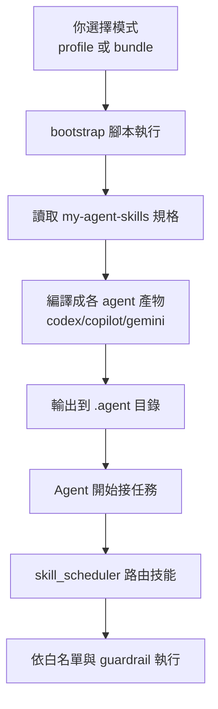
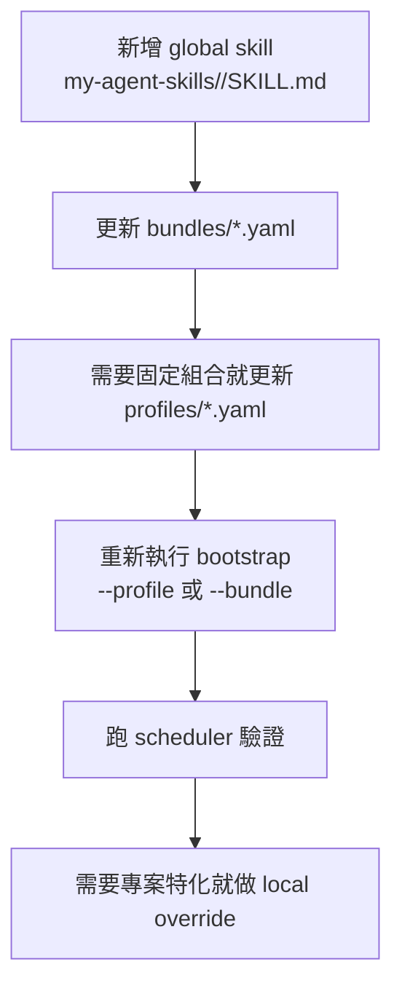

# my-agent-bootstrap 使用教學（繁體中文）

這份文件是「第一次接觸這個工具」的使用者版教學。  
目標是讓你知道：

1. 為什麼要輸入那些參數
2. 什麼時候用 `--profile`、什麼時候用 `--bundle`
3. 新增 skill 時要放哪裡、怎麼更新

## 1. 先說結論：你要做的事只有三步

1. 先把 bootstrap 裝進目標專案
2. 選擇一種模式套用（建議 `--profile`）
3. 跑 scheduler 驗證是否成功

## 2. 這個工具到底在幹嘛

你有兩個 repo：

1. `my-agent-skills`
- 放技能內容與規格（skills/bundles/policies/profiles）

2. `agent-bootstrap`
- 把上面的規格編譯成不同 CLI agent 看得懂的格式

所以它本質是「翻譯與整合層」。

## 3. 一圖看懂流程（每一步是做什麼）



## 4. 快速開始

### Windows

```bat
tools\bootstrap_agent.bat --target C:\path\to\your-project --force
```

### Linux/macOS

```bash
chmod +x tools/bootstrap_agent.sh
tools/bootstrap_agent.sh --target /path/to/your-project --force
```

這條命令會：

1. 把 `my-agent-skills` 掛進目標專案
2. 放入 `skill_scheduler.py` 與路由檔案
3. 做基本健康檢查

### 可直接複製的範例檔

1. `agent-bootstrap/examples/agent.profile.engineer-codex.yaml`
2. `agent-bootstrap/examples/agent.profile.finance-all.yaml`
3. `agent-bootstrap/examples/bundle.template.yaml`

其中 `bundle.template.yaml` 請複製到：

`my-agent-skills/bundles/<你的-bundle>.yaml`

## 5. `--profile` 與 `--bundle` 到底差在哪

### `--profile`（推薦）

代表：你有一個固定設定檔，想每次都套用同一套規則。

範例 `agent.profile.yaml`：

```yaml
name: engineer-codex
bundle: engineer
agent: codex
skills_repo: my-agent-skills
adapter_output: .agent
max_skill_reads: 3
generate_launchers: true
```

執行：

```bash
tools/bootstrap_agent.sh --target /path/to/project --profile agent.profile.yaml
```

適合場景：

1. 團隊共同使用
2. 要求可重現與可追蹤
3. 不想每次打很多參數

### `--bundle`

代表：你直接指定某一個技能組合包（不透過 profile 檔）。

```bash
tools/bootstrap_agent.sh --target /path/to/project --bundle engineer --agent codex
```

`--bundle engineer` 的意思：

1. 去讀 `my-agent-skills/bundles/engineer.yaml`
2. 用裡面列出的 skill 清單去編譯
3. 產生你指定 `--agent` 的輸出檔

適合場景：

1. 快速測試
2. 臨時實驗

注意：

1. `--profile` 和 `--bundle` 同一輪不能一起用

## 6. 為什麼要輸入這些參數（使用者視角）

| 參數 | 你為什麼需要填 | 系統會做什麼 |
|---|---|---|
| `--target` | 告訴工具「要裝在哪個專案」 | 在該專案寫入 bootstrap 與產物 |
| `--profile` | 想用既定設定一鍵套用 | 從 profile 讀 bundle/agent/output 設定 |
| `--bundle` | 想直接指定技能包 | 讀對應 bundle yaml 編譯 |
| `--agent` | 告訴系統要給哪個 AI CLI 用 | 產生 codex/copilot/gemini 對應檔 |
| `--adapter-output` | 想控制輸出目錄 | 把編譯結果寫到該路徑 |
| `--max-skill-reads` | 想控制 scheduler 讀取上限 | 套用 guardrail，避免過量讀取 |

## 7. 產物會長什麼樣

```text
<project>/.agent/
  codex/<bundle>/AGENTS.generated.md
  copilot/<bundle>/copilot.prompt.md
  gemini/<bundle>/gemini.prompt.md
  <adapter>/<bundle>/ir.json
  <adapter>/<bundle>/manifest.json
  launchers/launch_<adapter>.bat
  launchers/launch_<adapter>.sh
  profile.manifest.json
```

## 8. Scheduler 驗證範例

狀態檢查：

```bash
python skill_scheduler.py --status --format text
```

任務路由：

```bash
python skill_scheduler.py --task "請幫我規劃重構" --context "planning-implementation" --format json
```

白名單驗證：

```bash
python skill_scheduler.py \
  --task "請幫我規劃重構" \
  --context "planning-implementation" \
  --intent-whitelist "planning-implementation,handling-review" \
  --format json
```

## 9. 新增 skill 要放哪裡、怎麼做



實際步驟：

1. 新增檔案：`my-agent-skills/<new-skill>/SKILL.md`
2. frontmatter `name` 要穩定、唯一（建議小寫-hyphen）
3. 在 `## When to use this skill` 寫明確觸發條件
4. 把 skill id 加進 `my-agent-skills/bundles/*.yaml`
5. 若你用 profile，再更新 `my-agent-skills/profiles/*.yaml`
6. 在目標專案重新套用（`--profile` 或 `--bundle`）
7. 用 scheduler 指令做驗證

## 10. 專案差異要怎麼放

不要去改 global skill。  
請在目標專案放 local override：

```text
skills/<skill>/SKILL.md
```

規則：

1. local `name` 必須和 global skill identifier 完全相同
2. local 只寫專案差異，不要複製整份 global

## 11. 常見錯誤

1. `Bundle not found`  
`my-agent-skills/bundles/<bundle>.yaml` 不存在。

2. `missing skill`  
bundle 裡面引用的 skill id，找不到對應 `SKILL.md` 的 `name`。

3. `invalid_intent`  
`--context` 空值，或不在 `--intent-whitelist` 中。

4. `0 skill(s)`  
目標專案尚未成功掛上 `my-agent-skills`，重新跑 bootstrap（不要 `--skip-submodule`）。
