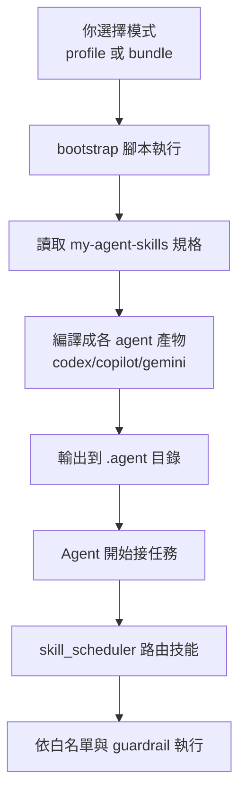
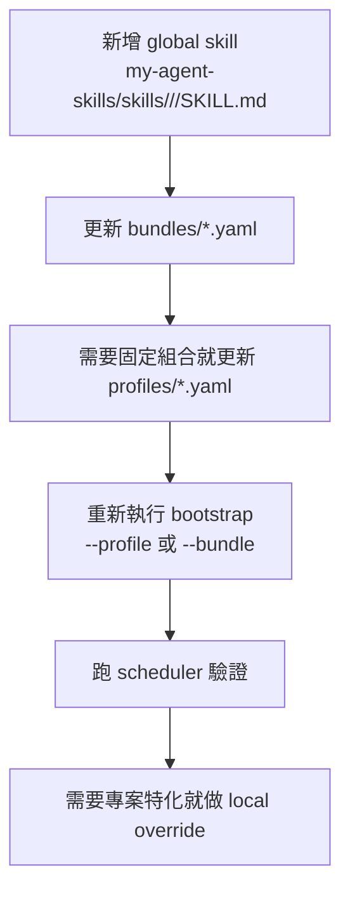

# my-agent-bootstrap 使用教學（繁體中文）

這份文件是「第一次接觸這個工具」的使用者版教學。  
目標是讓你知道：

1. 為什麼要輸入那些參數
2. 什麼時候用 `--profile`、什麼時候用 `--bundle`
3. 新增 skill 時要放哪裡、怎麼更新

## 1. 先說結論：你要做的事只有三步

1. 先把 bootstrap 裝進目標專案
2. 選擇一種模式套用（建議 `--profile`）
3. 已安裝過的專案升級時，改用 `--upgrade`
4. 跑 scheduler 驗證是否成功

## 2. 這個工具到底在幹嘛

你有兩個 repo：

1. `my-agent-skills`
- 放技能內容與規格（skills/bundles/policies/profiles）

2. `agent-bootstrap`
- 把上面的規格編譯成不同 CLI agent 看得懂的格式

所以它本質是「翻譯與整合層」。

## 3. 一圖看懂流程（每一步是做什麼）


```mermaid
flowchart TD
    A[你選擇模式<br/>profile 或 bundle] --> B[bootstrap 腳本執行]
    B --> C[讀取 my-agent-skills 規格]
    C --> D[編譯成各 agent 產物<br/>codex/copilot/gemini]
    D --> E[輸出到 .agent 目錄]
    E --> F[Agent 開始接任務]
    F --> G[skill_scheduler 路由技能]
    G --> H[依白名單與 guardrail 執行]
```

## 4. 快速開始

### Windows

```bat
tools\bootstrap_agent.bat --target C:\path\to\your-project --force
```

### Linux/macOS

```bash
chmod +x tools/bootstrap_agent.sh
tools/bootstrap_agent.sh --target /path/to/your-project --force
```

### 已 bootstrap 專案升級（推薦）

```bash
tools/bootstrap_agent.sh --target /path/to/your-project --upgrade --update-skills-remote
```

這條命令會：

1. 把 `my-agent-skills` 掛進目標專案
2. 放入 `skill_scheduler.py` 與路由檔案
3. 做基本健康檢查

### 可直接複製的範例檔

1. `agent-bootstrap/examples/agent.profile.engineer-codex.yaml`
2. `agent-bootstrap/examples/agent.profile.finance-all.yaml`
3. `agent-bootstrap/examples/bundle.template.yaml`

其中 `bundle.template.yaml` 請複製到：

`my-agent-skills/bundles/<你的-bundle>.yaml`

## 5. `--profile` 與 `--bundle` 到底差在哪

### `--profile`（推薦）

代表：你有一個固定設定檔，想每次都套用同一套規則。

範例 `agent.profile.yaml`：

```yaml
name: engineer-codex
bundle: engineer
agent: codex
skills_repo: my-agent-skills
adapter_output: .agent
max_skill_reads: 3
generate_launchers: true
```

執行：

```bash
tools/bootstrap_agent.sh --target /path/to/project --profile agent.profile.yaml
```

適合場景：

1. 團隊共同使用
2. 要求可重現與可追蹤
3. 不想每次打很多參數

### `--bundle`

代表：你直接指定某一個技能組合包（不透過 profile 檔）。

```bash
tools/bootstrap_agent.sh --target /path/to/project --bundle engineer --agent codex
```

`--bundle engineer` 的意思：

1. 去讀 `my-agent-skills/bundles/engineer.yaml`
2. 用裡面列出的 skill 清單去編譯
3. 產生你指定 `--agent` 的輸出檔

適合場景：

1. 快速測試
2. 臨時實驗

注意：

1. `--profile` 和 `--bundle` 同一輪不能一起用

## 6. 為什麼要輸入這些參數（使用者視角）

| 參數 | 你為什麼需要填 | 系統會做什麼 |
|---|---|---|
| `--target` | 告訴工具「要裝在哪個專案」 | 在該專案寫入 bootstrap 與產物 |
| `--profile` | 想用既定設定一鍵套用 | 從 profile 讀 bundle/agent/output 設定 |
| `--bundle` | 想直接指定技能包 | 讀對應 bundle yaml 編譯 |
| `--agent` | 告訴系統要給哪個 AI CLI 用 | 產生 codex/copilot/gemini 對應檔 |
| `--adapter-output` | 想控制輸出目錄 | 把編譯結果寫到該路徑 |
| `--max-skill-reads` | 想控制 scheduler 讀取上限 | 套用 guardrail，避免過量讀取 |
| `--upgrade` | 專案已裝過，想無痛重套 | 從 state 還原上次模式並強制更新受管檔案 |
| `--update-skills-remote` | 想同步最新 skill 包 | 先更新 `my-agent-skills` remote 再重編譯 |
| `--clean-stale` | 想清掉過期產物 | 依上次 state 清理不再使用的 generated 檔 |

補充：
1. `--upgrade` 會自動啟用覆寫與 stale 清理。
2. 升級狀態會寫在 `<adapter-output>/bootstrap.state.json`。

## 6.1 已安裝專案升級流程（免手動刪除）

若你已 bootstrap 過專案，更新 `agent-bootstrap` 後直接：

```bash
tools/bootstrap_agent.sh --target /path/to/project --upgrade
```

若沒有 state 或想明確指定，也可：

```bash
tools/bootstrap_agent.sh --target /path/to/project --upgrade --bundle engineer --agent codex
```

未指定 `--profile`/`--bundle` 時，會從 `bootstrap.state.json` 還原上次設定。

## 7. 產物會長什麼樣

```text
<project>/.agent/
  codex/<bundle>/AGENTS.generated.md
  copilot/<bundle>/copilot.prompt.md
  gemini/<bundle>/gemini.prompt.md
  <adapter>/<bundle>/ir.json
  <adapter>/<bundle>/manifest.json
  bundle.manifest.json
  launchers/launch_<adapter>.bat
  launchers/launch_<adapter>.sh
  profile.manifest.json
  bootstrap.state.json
```

## 7.1 多台電腦開發時，哪些該進版控

若你確定同一個專案會同時使用 `Codex + GitHub Copilot CLI + Gemini CLI`，建議用一份共用 profile，一次生成三套 prompt 與 launcher。

範例 `agent.profile.yaml`：

```yaml
name: engineer-tri-cli
bundle: engineer
agents:
  - codex
  - copilot
  - gemini
skills_repo: my-agent-skills
adapter_output: .agent
max_skill_reads: 3
generate_launchers: true
```

這樣做的好處：

1. 三個 CLI 共用同一份 bundle / whitelist / scheduler contract
2. 只要一個 bootstrap 指令就能一起更新三套產物
3. launcher 會在執行時解析 repo root 與 scheduler，不再把本機絕對路徑寫死

## 7.2 版本控制邊界（最佳實踐）

建議進版控，當作 source of truth：

1. `agent.profile.yaml` 或你選用的 profile / bundle 設定檔
2. `my-agent-skills/`：建議用 submodule，或直接 vendor 進 repo
3. `skills/`：只放這個專案特有的 local override

建議在本機重建，不要直接進版控：

1. `.agent/` 內的 prompt、IR、manifest、launchers
2. `bootstrap.state.json`
3. `.gitnexus/`
4. `.git/info/exclude` 內的本機忽略設定

Bootstrap runtime 有兩種策略，請選一種並保持一致：

1. 每台電腦重新 bootstrap（建議）：不提交 `AGENTS.md`、`GEMINI.md`、`skill_scheduler.py`、`bootstrap_fingerprint.py`、`services/skill_scheduler.py`、`tests/test_skill_scheduler.py`
2. repo 直接管理 bootstrap runtime：提交上述檔案，但每次 bootstrap 更新都要當作正式 source diff 審查

## 7.3 建議 `.gitignore`

若你採用「每台電腦重新 bootstrap」的最佳實踐，建議在目標專案 `.gitignore` 加上：

```gitignore
# Agent bootstrap generated outputs
.agent/
.gitnexus/

# Local bootstrap state
bootstrap.state.json

# Per-machine bootstrap runtime files
AGENTS.md
GEMINI.md
CLAUDE.md
skill_scheduler.py
bootstrap_fingerprint.py
services/skill_scheduler.py
tests/test_skill_scheduler.py
```

補充：

1. 若 `my-agent-skills/` 是 submodule，不要 ignore 它
2. 若 `skills/` 放的是專案特化 override，也不要 ignore
3. 若你採 repo-managed bootstrap，請把上述 runtime file 從 `.gitignore` 拿掉並正式提交

## 7.4 多機協作 SOP

### 新電腦第一次初始化

1. clone 專案
2. 若 `my-agent-skills/` 是 submodule，先執行：

```bash
git submodule update --init --recursive
```

3. 用共用 profile bootstrap：

```bash
tools/bootstrap_agent.sh --target /path/to/project --profile agent.profile.yaml --force
```

4. 驗證 scheduler：

```bash
python skill_scheduler.py --status --format text
python skill_scheduler.py --task "health check" --top 1 --format text
```

### 日常更新

當專案 local override、bundle/profile、或 `agent-bootstrap` 版本有變動時：

```bash
tools/bootstrap_agent.sh --target /path/to/project --upgrade
```

這會從 `bootstrap.state.json` 還原前一次模式，刷新受管檔案，並清理過期 `.agent` 產物。

### 先更新共用 skills 再重建

若你想先同步最新 `my-agent-skills` remote，再一起更新：

```bash
tools/bootstrap_agent.sh --target /path/to/project --upgrade --update-skills-remote
```

### 建立專案 local skill

當某個技能只屬於當前專案，不想直接改共用 `my-agent-skills` 時，可用：

```bash
python tools/bootstrap_add_local_skill.py \
  --project-root /path/to/project \
  --skill "Local Station Debug" \
  --description "project-only station debugging workflow" \
  --domain engineer \
  --bundle engineer
```

這會：

1. 建立 `skills/engineer/local-station-debug/SKILL.md`
2. 使用 `templates/skill/SKILL.md.tmpl` 的標準模板
3. 把 skill id 補進 `bundles.local/engineer.yaml`
4. 更新 source-of-truth，但 `.agent` 產物仍需重新整理

若你想替不同專案指定預設 bundle/domain 或自訂模板，可在專案根目錄放 `.agent-bootstrap.yaml`：

```yaml
local_skill_template: custom-skill-template.md.tmpl
default_domain: engineer
default_bundle: engineer
```

新增或修改任何 project-local skill 之後，請重新產生產物：

```bash
tools/bootstrap_agent.sh --target /path/to/project --upgrade
```

若你忘了 refresh，`skill_scheduler.py` 會主動提醒目前產物已 stale，並告訴你恢復指令。

### 三個 Agent 一起用時的建議

生成位置：

1. Codex: `.agent/codex/<bundle>/AGENTS.generated.md`
2. Copilot CLI: `.agent/copilot/<bundle>/copilot.prompt.md`
3. Gemini CLI: `.agent/gemini/<bundle>/gemini.prompt.md`

launcher：

1. `.agent/launchers/launch_codex.sh` / `.bat`
2. `.agent/launchers/launch_copilot.sh` / `.bat`
3. `.agent/launchers/launch_gemini.sh` / `.bat`

建議分工：

1. Codex：實作、重構、精準改碼
2. Copilot CLI：快速修補、小步迭代、測試循環
3. Gemini CLI：大範圍探索、綜整、review

使用方式：

```bash
./.agent/launchers/launch_codex.sh <your-codex-cli-command>
./.agent/launchers/launch_copilot.sh <your-copilot-cli-command>
./.agent/launchers/launch_gemini.sh <your-gemini-cli-command>
```

launcher 會自動提供：

1. `AGENT_BOOTSTRAP_ROOT`
2. `AGENT_SCHEDULER_PATH`
3. `PROMPT_FILE`

## 8. Scheduler 驗證範例

狀態檢查：

```bash
python skill_scheduler.py --status --format text
```

合併結果 / Policy 來源追蹤：

```bash
python tools/bootstrap_status.py \
  --profile ./agent.profile.yaml \
  --project-root . \
  --default-skills-repo ./my-agent-skills \
  --format json \
  --explain
```

這個指令可用來確認：

1. base bundle + `bundles.local/` 合併後實際生效哪些 skill
2. 某個 skill definition 來自 shared `my-agent-skills` 還是 local `skills/`
3. `max_skill_reads` 這類 policy 最後是哪一層覆寫勝出

任務路由：

```bash
python skill_scheduler.py --task "請幫我規劃重構" --context "planning-implementation" --format json
```

白名單驗證：

```bash
python skill_scheduler.py \
  --task "請幫我規劃重構" \
  --context "planning-implementation" \
  --intent-whitelist "planning-implementation,handling-review" \
  --format json
```

stale 產物檢查：

1. `skill_scheduler.py --status --format text` 會在 source 改過但尚未 refresh 時顯示警告
2. `skill_scheduler.py --status --format json` 會包含 `artifact_freshness.is_stale`
3. 恢復指令是 `tools/bootstrap_agent.sh --target /path/to/project --upgrade`

## 9. 新增 skill 要放哪裡、怎麼做


```mermaid
flowchart TD
    A[新增 global skill<br/>my-agent-skills/skills/<domain>/<skill>/SKILL.md] --> B[更新 bundles/*.yaml]
    B --> C[需要固定組合就更新 profiles/*.yaml]
    C --> D[重新執行 bootstrap<br/>--profile 或 --bundle]
    D --> E[跑 scheduler 驗證]
    E --> F[需要專案特化就做 local override]
```

實際步驟：

1. 新增檔案：`my-agent-skills/skills/<domain>/<new-skill>/SKILL.md`
2. frontmatter `name` 要穩定、唯一（建議小寫-hyphen）
3. 在 `## When to use this skill` 寫明確觸發條件
4. 把 skill id 加進 `my-agent-skills/bundles/*.yaml`
5. 若你用 profile，再更新 `my-agent-skills/profiles/*.yaml`
6. 在目標專案重新套用（`--profile` 或 `--bundle`）
7. 用 scheduler 指令做驗證

## 10. 專案差異要怎麼放

不要去改 global skill。  
請在目標專案放 local override：

```text
skills/<domain>/<skill>/SKILL.md
```

規則：

1. local `name` 必須和 global skill identifier 完全相同
2. local 只寫專案差異，不要複製整份 global
3. 修改後請重新執行 `tools/bootstrap_agent.sh --target /path/to/project --upgrade`

## 11. 常見錯誤

1. `Bundle not found`  
`my-agent-skills/bundles/<bundle>.yaml` 不存在。

2. `missing skill`  
bundle 裡面引用的 skill id，找不到對應 `SKILL.md` 的 `name`。

3. `invalid_intent`  
`--context` 空值，或不在 `--intent-whitelist` 中。

4. `0 skill(s)`  
目標專案尚未成功掛上 `my-agent-skills`，重新跑 bootstrap（不要 `--skip-submodule`）。

5. `--upgrade requested but no previous bootstrap state found`  
先補一次明確參數（`--profile` 或 `--bundle`）執行，產生 state 後再用 `--upgrade`。

6. `Generated agent artifacts are stale`  
你在上次 refresh 之後改了 `skills/`、`bundles.local/`、`agent.profile.yaml`，或更新了 `my-agent-skills`。執行 `tools/bootstrap_agent.sh --target /path/to/project --upgrade`。
